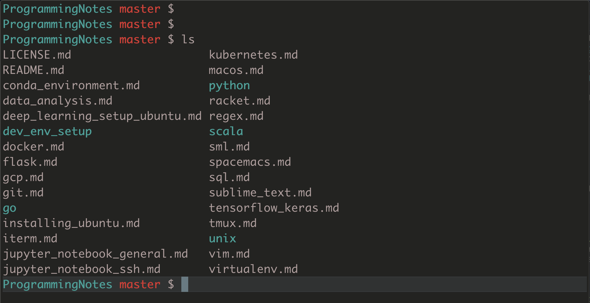

# Development Environment Setup on Mac

## Must Have

2. [XCode](https://developer.apple.com/xcode/): MacOS developer tools
	- `xcode-select --install`
3. [Homebrew](https://brew.sh/): Package manager for MacOS
4. [Alacritty](https://github.com/alacritty/alacritty):
5. [Oh-My-Zsh](https://ohmyz.sh/): Zsh shell and its framework
6. [Miniconda](https://docs.conda.io/en/latest/miniconda.html): Lightweight version of [Anaconda](https://www.anaconda.com/distribution/)
    - Move conda initializer from `.bash_profile` to `.zshrc`
7. [Rectangle](https://github.com/rxhanson/Rectangle): Window manager
8. Google Chrome

## If Necessary
1. Docker
2. Dropbox
3. 1Password

### Things to add to user preferences
* Put these in the `Preferences.sublime-settings--User` file found in Preferences > Settings (or by pressing Command + ,)
```json
{
	"font_size": 14,
	"translate_tabs_to_spaces": true
}
```

## Setup Terminal Theme

The files `palermo.zsh-theme` and `palermo-profile-iterm2.json` are complimentary and sets up the ideal theme for Zsh shell and the Iterm2 terminal:

* Move `palermo.zsh-theme` to `~/.oh-my-zsh/themes` then in `~/.zshrc`, set ZSH_THEME to `palermo`

* In Iterm2, go to __Preferences__, then __Profiles__. In the bottom left corner of the __Profile__ tab, click __Other Actions...__. From there select `Import JSON Profiles` and select `palermo-profile-iterm2.json`

Here's how it looks like



## Useful, but not too important
1. [zshmarks](https://github.com/jocelynmallon/zshmarks): Commandline directory bookmarking
2. [trash-cli](http://hasseg.org/trash/): Avoid `rm -rf *` horror and move deleted files to trash instead (can be installed with `brew install trash`)

## Useful settings and aliases to add to .zshrc
```bash
# Remove duplicates in history
setopt HIST_IGNORE_ALL_DUPS
alias jn='jupyter notebook'
alias zzz='pmset sleepnow'

# git
alias lgrh='echo "List GitHub clone url";curl https://api.github.com/users/palpen/repos?per_page=100 | grep  -o "https://github.com/[^\"]*\.git"'
alias ga='git add '
alias gc='git commit -m '
alias gst='git status'

# Get cd history using `cd - TAB`
# From from https://unix.stackexchange.com/a/157773
setopt AUTO_PUSHD                  # pushes the old directory onto the stack
setopt PUSHD_MINUS                 # exchange the meanings of '+' and '-'
setopt CDABLE_VARS                 # expand the expression (allows 'cd -2/tmp')
autoload -U compinit && compinit   # load + start completion
zstyle ':completion:*:directory-stack' list-colors '=(#b) #([0-9]#)*( *)==95=38;5;12'
```

## Vim and Tmux config files
See https://github.com/palpen/config_files


## Useful Command Line Tools
1. `man` replacement: [tldr](https://tldr.sh/#installation)
2. `find` replacement: [fd](https://github.com/sharkdp/fd/)
3. `cat` replacement: [bat](https://github.com/sharkdp/bat)
4. `fzf` for quick fuzzy searching: [fzf](https://github.com/junegunn/fzf)
5. Others: https://remysharp.com/2018/08/23/cli-improved

## Miscellaneous settings
* Prevent switching deskstop spaces when switching to an application
	- Go to System Preferences > Mission Control, deselect "When switching to an application, switch to a Space with open windows for the application"

* Restore windows, tabs, and panes when restarting Iterm2
    * In Iterm2 under Preferences > General > Startup set the Window restoration policy to "Use System Window Restoration Setting"
    * In MacOS, go to System Preferences > General and uncheck "Close windows when quitting an app"
